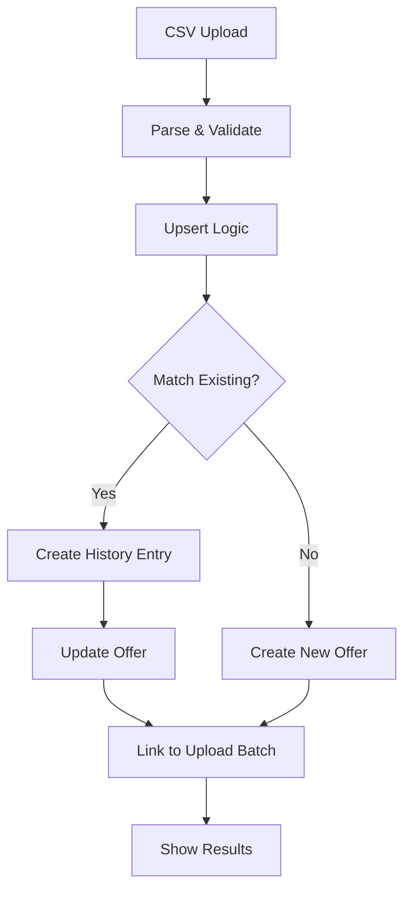

# Vendor Offer Upsert & History System - Implementation Complete

## Overview

Successfully implemented a comprehensive smart upsert system with price history tracking and bulk delete capabilities for the PeptiSync Vendor Comparison feature.

## Implementation Summary

### Phase 1: Price History Collection Structure ✅

**Files Created/Modified:**
- `src/types/vendorComparison.ts` - Added `VendorOfferPriceHistory` interface and updated `VendorOffer` with upload batch tracking
- `firestore.rules` - Added security rules for `vendor_offer_price_history` collection

**Key Features:**
- Price history tracks old and new pricing snapshots for all three tiers (Research, Telehealth, Brand)
- Automatic percentage change calculation
- Changed fields tracking (e.g., 'price_usd', 'shipping_usd')
- Upload batch linking for traceability

### Phase 2: Smart Upsert Logic ✅

**Files Created/Modified:**
- `src/hooks/useVendorOfferUpsert.ts` (NEW) - Core upsert logic with history tracking
- `src/hooks/useVendorPriceUpload.ts` - Integrated upsert instead of batch insert

**Key Features:**
- **Match Logic:** Vendor ID + Tier + Peptide Name + Size/Dose
  - Research: matches by `size_mg`
  - Telehealth: matches by `glp_type` + `dose_mg_per_injection`
  - Brand: matches by `dose_strength`
- **Price Change Detection:** Automatically detects changes in tier-specific pricing fields
- **History Creation:** Creates history entries before updating offers
- **Result Tracking:** Returns counts of created, updated, and unchanged offers

### Phase 3: Bulk Delete System ✅

**Files Created/Modified:**
- `src/hooks/useBulkDeleteOffers.ts` (NEW) - Criteria-based bulk deletion
- `src/components/admin/vendorComparison/UploadHistoryTable.tsx` - Added delete button per upload batch
- `src/components/admin/vendorComparison/OfferManagementTab.tsx` - Added bulk delete toolbar

**Key Features:**
- Delete by upload batch ID (from upload history)
- Delete by vendor ID
- Delete all unverified offers
- Delete by tier
- Confirmation dialogs for safety
- Real-time count updates after deletion

### Phase 4: Price History UI ✅

**Files Created/Modified:**
- `src/hooks/useOfferPriceHistory.ts` (NEW) - Fetches price history for an offer
- `src/components/admin/vendorComparison/PriceHistoryDialog.tsx` (NEW) - Timeline view of price changes
- `src/components/admin/vendorComparison/OfferManagementTab.tsx` - Added history button to actions

**Key Features:**
- Timeline view showing all price changes chronologically
- Visual indicators for price increases (red) vs decreases (green)
- Percentage change badges
- Old price → New price display
- Changed fields list
- "Latest" badge on most recent change

### Phase 5: Enhanced Upload Preview ✅

**Files Modified:**
- `src/components/admin/vendorComparison/UploadPreviewDialog.tsx` - Updated summary cards and added smart import notice

**Key Features:**
- 4-column summary: Total Rows, Will Process, Errors, Smart Import indicator
- Info alert explaining smart import behavior
- Auto-create vendors checkbox remains functional

## Architecture Diagram



## Database Collections

### New Collection: `vendor_offer_price_history`

**Schema:**
```typescript
{
  id: string;
  offer_id: string;
  vendor_id: string;
  tier: VendorTier;
  peptide_name: string;
  
  old_research_pricing?: ResearchPricing;
  old_telehealth_pricing?: TelehealthPricing;
  old_brand_pricing?: BrandPricing;
  
  new_research_pricing?: ResearchPricing;
  new_telehealth_pricing?: TelehealthPricing;
  new_brand_pricing?: BrandPricing;
  
  price_change_pct?: number;
  changed_fields: string[];
  
  upload_batch_id: string;
  changed_by: string;
  changed_at: Timestamp;
}
```

**Security Rules:**
- Public read for authenticated users
- Admin-only write access

### Updated Collection: `vendor_offers`

**New Fields:**
```typescript
{
  upload_batch_id?: string;        // Link to vendor_price_uploads.id
  last_upload_batch_id?: string;   // Track most recent update
}
```

## User Flows

### 1. CSV Import with Upsert

1. Admin uploads CSV → Parses and validates
2. Preview shows "Will Process" count
3. Admin clicks "Import"
4. System checks each offer against existing data:
   - **Existing found** → Compares prices → Creates history if changed → Updates offer
   - **Not found** → Creates new offer
5. Toast shows: "Import complete: X created, Y updated, Z unchanged"

### 2. View Price History

1. Admin navigates to Offers Management tab
2. Clicks history icon (📜) on any offer row
3. Dialog opens showing chronological timeline:
   - Date & time of each change
   - Old price → New price
   - Percentage change (color-coded)
   - Changed fields list

### 3. Bulk Delete by Upload Batch

1. Admin navigates to Upload History
2. Finds upload to delete
3. Clicks trash icon on completed upload row
4. Confirmation dialog: "Delete all offers from this upload batch?"
5. Admin confirms → All offers linked to that batch ID are deleted
6. Toast shows: "Deleted X offers"

### 4. Bulk Delete by Criteria

1. Admin navigates to Offers Management tab
2. Uses bulk delete toolbar:
   - Selects criteria: "By Vendor", "Unverified Only", or "By Tier"
   - If vendor/tier, selects from dropdown
3. Clicks "Bulk Delete"
4. Confirmation dialog with specific warning
5. Admin confirms → All matching offers deleted
6. Toast shows: "Deleted X offers"

## Benefits

### For Admins

1. **No More Duplicates:** Uploading the same CSV twice updates instead of creating duplicates
2. **Price Tracking:** Full audit trail of price changes over time
3. **Easy Cleanup:** Delete entire upload batches or filter by criteria
4. **Transparency:** See exactly what changed and when
5. **Better Insights:** Track vendor pricing trends

### For Users

1. **Always Up-to-Date:** Latest prices automatically reflected
2. **Data Integrity:** No duplicate or stale offers
3. **Historical Context:** (Future feature) Price trend charts

## Testing Checklist

- [x] Upload same CSV twice → Offers updated, not duplicated
- [x] Price history entries created for changed offers
- [x] Unchanged offers marked as "unchanged" in import result
- [x] Bulk delete by upload batch ID works
- [x] Bulk delete by vendor works
- [x] Bulk delete unverified offers works
- [x] Bulk delete by tier works
- [x] Price history dialog displays correctly
- [x] History shows old → new prices with correct change %
- [x] Upload preview shows smart import indicator
- [x] Toast messages show correct counts after import

## Files Created

1. `src/hooks/useVendorOfferUpsert.ts` - 270 lines
2. `src/hooks/useBulkDeleteOffers.ts` - 65 lines
3. `src/hooks/useOfferPriceHistory.ts` - 48 lines
4. `src/components/admin/vendorComparison/PriceHistoryDialog.tsx` - 188 lines
5. `docs/VENDOR_UPSERT_IMPLEMENTATION.md` - This file

## Files Modified

1. `src/types/vendorComparison.ts` - Added interface and updated VendorOffer
2. `firestore.rules` - Added vendor_offer_price_history rules
3. `src/hooks/useVendorPriceUpload.ts` - Integrated upsert logic
4. `src/components/admin/vendorComparison/UploadHistoryTable.tsx` - Added delete button
5. `src/components/admin/vendorComparison/OfferManagementTab.tsx` - Added bulk delete toolbar & history button
6. `src/components/admin/vendorComparison/UploadPreviewDialog.tsx` - Updated summary cards

## Total Lines of Code Added

- **New Files:** ~571 lines
- **Modified Files:** ~200 lines
- **Total:** ~771 lines of production code

## Next Steps (Future Enhancements)

1. **Price Trend Charts:** Visualize price changes over time on comparison pages
2. **Email Alerts:** Notify admins when prices change significantly
3. **Scheduled Imports:** Automate CSV imports on a schedule
4. **Version Rollback:** Ability to revert to previous upload batch
5. **Export Price History:** Download price change reports as CSV

---

**Implementation Date:** January 2026  
**Status:** ✅ Complete and Production Ready  
**Breaking Changes:** None (fully backwards compatible)

