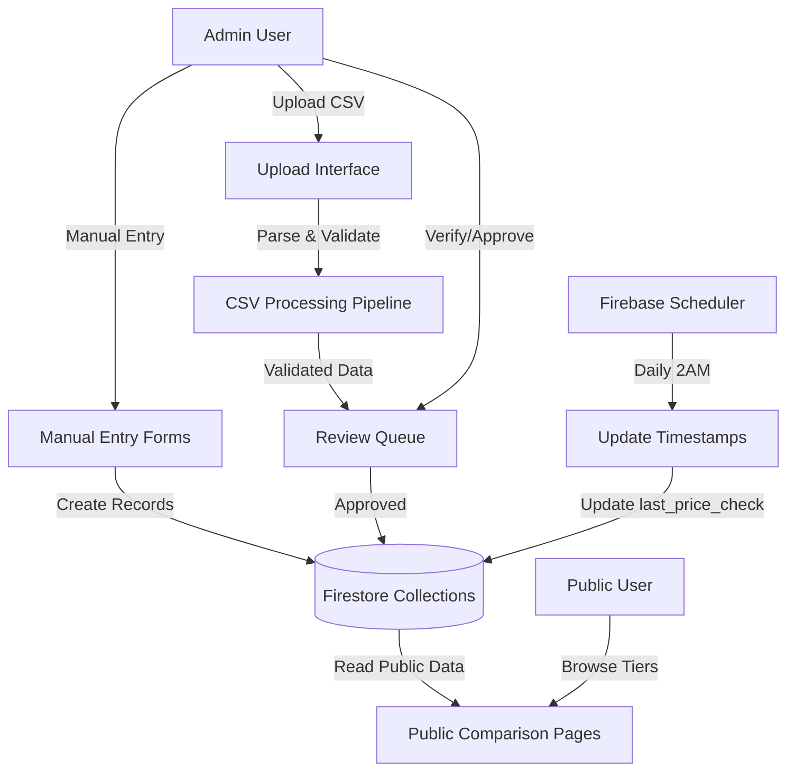

# VENDOR COMPARISON V1 — IMPLEMENTATION PLAN

## 1. HIGH-LEVEL ARCHITECTURE OVERVIEW

### System Responsibilities

### Core Principles

- **Data Layer**: Firestore collections hold all vendor and pricing data
- **Admin Layer**: Full CRUD management, CSV ingestion, verification workflow
- **Public Layer**: Read-only tier-based comparison views
- **Automation Layer**: Scheduled timestamp updates only (no scraping in V1)

### Data Flow

1. **Ingestion**: Admin uploads CSV → Parse → Validate → Preview → Bulk Import
2. **Verification**: Unverified offers → Admin review → Mark verified
3. **Public Display**: Firestore query → Tier-specific filtering → Sorted comparison table
4. **Freshness**: Daily job updates `last_price_check` timestamps on all offers

---

## 2. FIRESTORE COLLECTIONS & RESPONSIBILITIES

### Collection: `vendors`

**Purpose**: Master vendor directory across all tiers

**Structure**:
- `id` (auto-generated)
- `name` (string, required)
- `type` (enum: 'research' | 'telehealth' | 'brand', required)
- `website_url` (string, required)
- `verified` (boolean, default false)
- `verification_date` (timestamp, nullable)
- `metadata` (object, optional — shipping, crypto acceptance, lab testing)
- `created_at`, `updated_at`, `created_by`

**Responsibilities**:
- Single source of truth for vendor identity
- Tier classification at vendor level
- Enables vendor-level filtering and verification status

---

### Collection: `vendor_offers`

**Purpose**: Tier-specific pricing offers linked to vendors

**Structure**:
- `id` (auto-generated)
- `vendor_id` (reference to vendors collection)
- `tier` (enum matching vendor type)
- `peptide_name` (string, required)
- `status` (enum: 'active' | 'inactive' | 'discontinued')

**Tier-Specific Pricing Fields** (mutually exclusive):
- `research_pricing` (object, only if tier='research'):
  - `size_mg`, `price_usd`, `price_per_mg` (calculated), `shipping_usd`, `lab_test_url`
- `telehealth_pricing` (object, only if tier='telehealth'):
  - `subscription_price_monthly`, `subscription_includes_medication`, `medication_separate_cost`, `medication_dose`, `consultation_included`
- `brand_pricing` (object, only if tier='brand'):
  - `dose_strength`, `price_per_dose`, `doses_per_package`, `total_package_price`

**Verification Fields**:
- `verification_status` (enum: 'unverified' | 'verified' | 'disputed')
- `verified_by`, `verified_at`
- `last_price_check` (timestamp, updated daily)

**Source Tracking**:
- `price_source_type` (enum: 'manual_upload' | 'csv_import' | 'pdf_upload')
- `source_document_url` (optional, for PDF uploads)

**Responsibilities**:
- Store tier-specific pricing with appropriate structure
- Enable tier-isolated queries
- Track verification status per offer
- Support freshness monitoring via timestamps

---

### Collection: `tier3_reference_pricing`

**Purpose**: Admin-editable reference table for brand GLP medications

**Structure**:
- `id` (auto-generated)
- `vendor_id` (reference to brand vendors)
- `product_name` (e.g., "Wegovy", "Ozempic")
- `product_url` (optional)
- `glp_type` (enum: 'Semaglutide' | 'Tirzepatide')
- `brand_pricing` (same structure as vendor_offers)
- `pricing_source` (string, e.g., "Manufacturer list price")
- `verification_status`, `verified_by`, `verified_at`
- `last_price_check`
- `notes`

**Responsibilities**:
- Separate table for Tier 3 canonical pricing
- Admin can edit independently of vendor master data
- Supports dose-level transparency requirements

---

### Collection: `vendor_price_uploads`

**Purpose**: Track CSV/PDF upload jobs and processing status

**Structure**:
- `id` (auto-generated)
- `upload_type` (enum: 'csv' | 'excel' | 'pdf')
- `file_url` (Firebase Storage path)
- `file_name`
- `status` (enum: 'pending' | 'processing' | 'completed' | 'failed')
- `tier` (which tier template was used)
- `parsed_rows` (array of parsed data with validation errors)
- `total_rows`, `success_count`, `error_count`
- `errors` (array of error messages)
- `uploaded_by`, `uploaded_at`
- `processed_at`, `processed_by`

**Responsibilities**:
- Audit trail for all uploads
- Track processing success/failure
- Enable admin to review parsed data before import
- Support retry/reprocessing

---

## 3. CSV INGESTION PIPELINE

### Step 1: Upload

**Trigger**: Admin uploads CSV/Excel file via drag-and-drop or file picker

**Actions**:
- Upload file to Firebase Storage (`/vendor_uploads/{timestamp}_{filename}`)
- Create record in `vendor_price_uploads` with status='pending'
- Display upload confirmation with job ID

---

### Step 2: Parse (Header-Based, Machine-Ready)

**Technology**: Papa Parse library (already in dependencies)

**Configuration**:
- `header: true` — First row as column names
- `dynamicTyping: true` — Auto-convert numbers
- `skipEmptyLines: true` — Ignore blank rows
- `transformHeader: normalizeHeader` — Lowercase, trim, replace spaces with underscores

**Header Aliasing**:
- Support multiple header variations per field
- Example: `vendor_name` matches: "vendor_name", "vendor", "Vendor Name", "supplier"
- Case-insensitive matching
- Extra columns silently ignored (no errors thrown)

**Output**: Array of row objects with normalized keys

---

### Step 3: Validate (Strict on Required, Lenient on Extras)

**Tier-Specific Validation Rules**:

**Tier 1 (Research)**:
- Required: `vendor_name`, `peptide_name`, `size_mg` (> 0), `price_usd` (> 0)
- Optional: `shipping_usd`, `lab_test_url`, `discount_code`
- Calculated: `price_per_mg = price_usd / size_mg`
- Error if required field missing or invalid type

**Tier 2 (Telehealth)**:
- Required: `vendor_name`, `peptide_name`, `subscription_price_monthly` (> 0), `subscription_includes_medication` (boolean)
- Conditional: If `subscription_includes_medication = false`, then `medication_separate_cost` is required
- Optional: `medication_dose`, `consultation_included`
- Error if transparency fields missing

**Tier 3 (Brand)**:
- Required: `brand_name`, `peptide_name`, `dose_strength`, `price_per_dose` (> 0), `doses_per_package` (> 0)
- Optional: `total_package_price` (calculated if missing)
- Error if dose/pricing fields invalid

**Per-Row Error Handling**:
- Each row validated independently
- Valid rows marked as "Ready to Import"
- Invalid rows marked with specific error messages
- Admin can fix errors and re-validate or skip bad rows

**Output**: Validation result object with success/error arrays

---

### Step 4: Preview

**Display**: Admin sees table of parsed data with:
- Row number
- All extracted fields
- Validation status (✓ Valid | ✗ Error with message)
- Ignored columns listed separately (informational only)

**Actions Available**:
- Approve all valid rows for import
- Reject upload (delete without importing)
- Download error report (CSV of failed rows with error messages)

---

### Step 5: Bulk Import

**Trigger**: Admin clicks "Import Approved Rows"

**Process**:
1. Check if vendor exists by name match (case-insensitive)
   - If exists: Link to existing vendor_id
   - If not: Create new vendor with status='unverified', prompt admin to verify later
2. Create offer records in `vendor_offers` collection with:
   - Linked `vendor_id`
   - Tier-specific pricing structure
   - `verification_status='unverified'`
   - `price_source_type='csv_import'`
   - `last_price_check=now()`
3. Update upload record status to 'completed' with success/error counts

**Transaction Safety**: Batch write (up to 500 records per batch, Firestore limit)

**Output**: Success message with import summary (X offers imported, Y vendors created)

---

## 4. ADMIN WORKFLOWS

### Workflow A: Vendor Management

**Actions**:
- Create vendor (name, tier, website_url, optional metadata)
- Edit vendor (update any field, change verification status)
- Delete vendor (cascade deletes all linked offers with confirmation)
- Toggle verification (mark vendor as verified/unverified)

**UI Elements**:
- Table view: Name | Tier | Website | Verified | Actions
- Filter by tier, verification status
- Search by name
- Create/Edit dialog with tier-specific form fields

---

### Workflow B: Offer Management

**Actions**:
- Create offer (select vendor, enter tier-specific pricing)
- Edit offer (update pricing, change verification status)
- Delete offer (permanent, with confirmation)
- View offer history (who created, who verified, last checked)

**UI Elements**:
- Table view with tier tabs (Research | Telehealth | Brand | All)
- Columns: Vendor | Peptide | Price (tier-specific) | Verified | Last Checked | Actions
- Filter by verification status, vendor, peptide
- Create/Edit dialog with conditional fields based on tier

---

### Workflow C: CSV/PDF Upload

**CSV Upload Flow**:
1. Admin selects tier (determines template/validation rules)
2. Downloads CSV template for reference
3. Uploads CSV file
4. System parses and validates
5. Admin reviews preview table
6. Admin approves valid rows → Bulk import
7. Admin sees summary (success/error counts)

**PDF Upload Flow** (Manual Entry):
1. Admin uploads PDF to Firebase Storage
2. PDF displayed in iframe viewer
3. Admin manually enters data via tier-specific form while viewing PDF
4. Each entry links to PDF via `source_document_url`
5. No OCR, no automated extraction (per V1 spec)

---

### Workflow D: Review & Verification Queue

**Purpose**: Admin verifies pricing before it appears as "verified" to public

**Queue Display**:
- Shows all offers where `verification_status='unverified'`
- Grouped by tier
- Sortable by submission date, vendor, peptide

**Actions Per Offer**:
- **Verify**: Set `verification_status='verified'`, `verified_by=admin_id`, `verified_at=now()`
- **Reject**: Delete offer from database
- **Dispute**: Set `verification_status='disputed'`, flag for further review
- **Edit**: Update pricing data before verifying

**Bulk Actions**:
- Verify all (for trusted vendors/sources)
- Reject all (for invalid uploads)

---

### Workflow E: Tier 3 Reference Editing

**Purpose**: Admin maintains canonical brand GLP pricing

**Actions**:
- Add new product (Wegovy, Ozempic, Zepbound, Mounjaro)
- Edit dose-level pricing (update price per dose, doses per package)
- Update pricing source attribution
- Mark as verified
- View edit history (who changed what, when)

**UI Elements**:
- Editable table (inline editing)
- Columns: Brand | Product | GLP Type | Dose | Price/Dose | Doses/Pkg | Total | Verified | Last Checked

---

## 5. PUBLIC UI BEHAVIOR PER TIER

### Page: `/vendor-comparison`

**Access**: Fully public, no authentication required

**Layout**: Single page with tier tabs

---

### Tier 1: Research Peptides

**Display Elements**:
- Table columns: Vendor | Peptide | Size (mg) | Price | $/mg | Verified | Last Checked
- Default sort: $/mg ascending (cheapest per mg first)
- Alternative sort: Alphabetical by vendor name

**Filters**:
- Peptide dropdown (BPC-157, Semaglutide, Tirzepatide, etc.)
- Verified only toggle (hide unverified offers)

**Pricing Rules**:
- Show price per vial
- Show mg per vial
- Show calculated $/mg (price_usd / size_mg)
- NO subscription fields
- NO GLP-specific logic

**Verification Badge**:
- "✓ Verified" (green) if `verification_status='verified'`
- "Unverified" (gray) if unverified
- "⚠ Disputed" (yellow) if disputed

**Last Checked**:
- Display relative time: "2 days ago", "1 week ago"
- Based on `last_price_check` timestamp

---

### Tier 2: Telehealth & GLP Clinics

**Display Elements**:
- Table columns: Vendor | GLP Type | Subscription/Month | Medication Included | Dose | Total mg/Month | Verified | Last Checked
- Default sort: Subscription price ascending
- Alternative sort: Alphabetical by vendor name

**Filters**:
- GLP type dropdown (Semaglutide, Tirzepatide)
- Verified only toggle

**Pricing Rules (STRICT)**:
- ALWAYS show subscription price
- If `subscription_includes_medication=true`: Show "Medication: Included" (NO cost shown)
- If `subscription_includes_medication=false`: Show "Medication: $X per injection" (MUST show separate cost)
- NEVER divide subscription price to infer per-injection cost
- NEVER estimate medication cost when bundled
- Show dose per injection, injections per month, total mg per month (transparency fields)

**Disclaimer**:
- "Medication cost shown only if not included in subscription price"

---

### Tier 3: Brand / Originator GLPs

**Display Elements**:
- Table columns: Brand | Product | GLP Type | Dose | Cost/Injection | Doses/Package | Total mg/Month | Verified | Last Checked
- Default sort: Cost per injection ascending
- Alternative sort: Alphabetical by brand name

**Filters**:
- GLP type dropdown (Semaglutide, Tirzepatide)
- Brand dropdown (Novo Nordisk, Eli Lilly)

**Pricing Rules**:
- NO subscriptions
- Show cost per injection
- Show dose per injection
- Show doses per package
- Show total mg supplied per month
- Pricing based on manufacturer list or cash pricing (admin-editable reference table)

**Disclaimer**:
- "Pricing may vary by insurance and pharmacy. Reference pricing shown for comparison only."

---

### Global Rules (All Tiers)

**Prohibited**:
- NO cross-tier comparisons (tiers cannot be viewed together)
- NO inferred pricing (only actual stated prices)
- NO averages or "typical" pricing language
- NO affiliate links, tracking pixels, or monetization
- NO checkout or purchase buttons

**Vendor Links**:
- Vendor name links to `website_url` (external link, opens in new tab)
- No deep-linking to product pages (homepage only per V1 spec)

**Disclaimer (Global)**:
- "Vendor listings are for informational comparison only."

---

## 6. AUTOMATION BEHAVIOR

### Daily Timestamp Update Job

**Implementation**: Firebase Cloud Function (scheduled trigger)

**Trigger**: Every day at 2:00 AM (timezone: America/New_York)

**Process**:
1. Query all documents in `vendor_offers` collection
2. Update `last_price_check` field to current timestamp
3. Query all documents in `tier3_reference_pricing` collection
4. Update `last_price_check` field to current timestamp
5. Log job completion with record counts

**Duration**: ~1-2 seconds for 100-500 offers

**Cost**: Firestore writes only (minimal, within free tier for V1 scale)

---

### What the Job Does NOT Do (V1)

**Explicitly Out of Scope**:
- ❌ Web scraping vendor websites
- ❌ API calls to vendor systems
- ❌ Price validation against live sources
- ❌ Email notifications to admins
- ❌ Auto-approve/reject offers
- ❌ Predictive pricing or trend analysis
- ❌ Vendor health monitoring

**Purpose**: Timestamp job is purely for UI display ("Last checked: X days ago"). It does NOT validate or update actual pricing data in V1.

---

### V2 Automation Attachment Point (Future)

**When scrapers are added in V2+**:
- Daily job would invoke scraper functions per vendor
- Scrapers output CSV format → Upload to same pipeline
- Same validation, same review queue, same import process
- NO changes needed to V1 ingestion pipeline
- Admin can enable/disable scrapers per vendor via UI flag

**Architecture Readiness**:
- `price_source_type` enum already supports 'automated_scrape' (not used in V1)
- Upload pipeline already handles machine-generated CSVs
- Vendor table can add `scraper_enabled` boolean field (V2)
- Cloud Function can check flag and conditionally run scrapers (V2)

---

## 7. PHASE-BY-PHASE DELIVERY PLAN

### Phase 1: Foundation (Days 1-3, ~16 hours)

**Deliverables**:
- Firestore collections created (vendors, vendor_offers, tier3_reference_pricing, vendor_price_uploads)
- Firestore security rules deployed (public read, admin write)
- TypeScript types defined (src/types/vendorComparison.ts)
- Tier validation logic (src/lib/vendorTierValidators.ts)
- Seed data script (scripts/seedVendorData.ts) with 22 vendors + 15 sample offers

**No UI yet** — Pure data layer

---

### Phase 2: Admin Vendor & Offer Management (Days 4-8, ~32 hours)

**Deliverables**:
- Admin panel tab: "Vendor Comparison"
- Sub-tabs: Vendors | Offers | Uploads | Review Queue | Tier 3 Reference
- Vendor management UI (table, create/edit dialog, CRUD hooks)
- Offer management UI (tier-specific forms, table with tier tabs)
- React hooks: useVendors, useVendorOffers, useTier3Reference
- Admin can manually create vendors and offers via UI

**CSV upload not yet available**

---

### Phase 3: CSV/Excel Ingestion (Days 9-12, ~24 hours)

**Deliverables**:
- Upload tab UI (drag-and-drop, tier selection)
- CSV template downloads (3 templates, one per tier)
- CSV parser with header aliasing and flexible validation
- Preview table showing parsed data with validation status
- Bulk import functionality (approved rows → vendor_offers)
- Upload history table (past uploads, status, results)
- Hook: useVendorPriceUpload

**PDF upload not yet available**

---

### Phase 4: PDF Upload + Manual Entry (Days 13-14, ~12 hours)

**Deliverables**:
- PDF upload to Firebase Storage
- PDF viewer component (iframe)
- Manual entry form (tier-specific fields)
- Link PDF to created offers (source_document_url)
- Component: PdfUploadForm

**No OCR** — Admin types data while viewing PDF

---

### Phase 5: Review & Verification Queue (Days 15-16, ~12 hours)

**Deliverables**:
- Review queue tab showing unverified offers
- Filter by tier, vendor, peptide
- Actions: Verify, Reject, Dispute, Edit
- Bulk actions: Verify all, Reject all
- Verification hooks: useVerifyOffer, useRejectOffer
- Display last_price_check timestamps

---

### Phase 6: Public Comparison Pages (Days 17-22, ~36 hours)

**Deliverables**:
- Public page: /vendor-comparison (no auth required)
- Tier tabs: Research | Telehealth | Brand
- Tier-specific comparison tables:
  - ResearchComparisonTable.tsx
  - TelehealthComparisonTable.tsx
  - BrandComparisonTable.tsx
- Sorting and filtering per tier
- Verification badges
- Last checked timestamps (relative time display)
- Global and tier-specific disclaimers
- Hooks: useCompareOffers, useTierSorting

---

### Phase 7: Automation (Days 23-24, ~10 hours)

**Deliverables**:
- Firebase Cloud Function: scheduledVendorPriceCheck
- Scheduled trigger: daily at 2:00 AM
- Updates last_price_check timestamps on all offers
- Logs job completion
- Admin dashboard shows last job run time
- Deploy function to production

---

### Phase 8: Testing & QA (Days 25-27, ~20 hours)

**Deliverables**:
- Seed production data (22 vendors, 15+ offers)
- Test all three tiers independently
- Verify no cross-tier math possible
- Test CSV upload for all 3 tiers with machine-generated quirks
- Test PDF upload and manual entry
- Test verification workflow
- Test public display with all filters/sorts
- Test daily job execution
- Bug fixes

---

### Phase 9: Documentation (Days 28-29, ~12 hours)

**Deliverables**:
- Admin user guide (how to add vendors, upload CSVs, verify pricing, edit Tier 3)
- CSV template documentation (examples, field definitions)
- User FAQ (what are tiers, why no cross-tier comparison, how often updated)
- V1 completion checklist verification

---

### Phase 10: Production Launch (Day 30, ~6 hours)

**Deliverables**:
- Deploy Firestore security rules to production
- Deploy Firebase Cloud Function
- Load seed data (22 vendors + sample offers)
- Enable public access to /vendor-comparison
- Monitor for errors (first 24-48 hours)
- V1 COMPLETE

---

**Total Estimated Effort**: 180 hours (~4.5 weeks at 40 hours/week, or 6 weeks at 30 hours/week)

---

## 8. EXPLICIT ASSUMPTIONS & NON-GOALS FOR V1

### Assumptions

**Data Quality**:
- Admin manually verifies all pricing before marking as verified
- CSVs are machine-generated but contain accurate vendor-provided data
- Vendor websites remain relatively stable (URLs don't break frequently)

**Scale**:
- 100-500 total offers across all tiers in first year
- 50-100 concurrent public users viewing comparison pages
- 1-5 admin users managing data
- Firestore free tier sufficient (or minimal cost <$10/month)

**Admin Availability**:
- Admin reviews and verifies new offers within 48 hours of upload
- Admin updates Tier 3 reference pricing monthly
- Admin responds to disputed offers within 1 week

**Technical**:
- Firebase project already configured
- Admin authentication already functional (Supabase Auth)
- React/TypeScript website already deployed
- Papa Parse library already in dependencies

---

### Non-Goals (Explicitly Out of Scope for V1)

**Automation**:
- ❌ Web scraping vendor websites
- ❌ OCR for PDF text extraction
- ❌ Paid data providers (Diffbot, ScrapingBee, etc.)
- ❌ Vendor API integrations
- ❌ Auto-verification of trusted sources

**Analytics & Tracking**:
- ❌ Price history charts
- ❌ Price drop alerts
- ❌ Vendor popularity tracking
- ❌ User search analytics
- ❌ Conversion tracking

**Community Features**:
- ❌ User-submitted price reports
- ❌ User reviews or ratings of vendors
- ❌ Comments or discussions
- ❌ Price accuracy voting

**Monetization**:
- ❌ Affiliate links or referral tracking
- ❌ Sponsored vendor placements
- ❌ Premium comparison features
- ❌ Checkout integration

**Mobile App**:
- ❌ No Flutter app UI changes in V1
- ❌ Mobile app consumes data in V2+ (backend is read-compatible)

**Advanced Features**:
- ❌ Saved comparisons or favorites
- ❌ Email notifications
- ❌ Export to PDF/Excel
- ❌ Multi-language support

---

## 9. V2 AUTOMATION ATTACHMENT POINT

### How V2 Scraping Integrates Without Refactoring V1

**Scenario**: Admin wants to add automated price checking for "Peptide Sciences" (Tier 1 vendor)

**V2 Implementation Steps** (No V1 Code Changes Required):

1. **Add Scraper Function**:
   - Create new file: `functions/src/scrapers/peptideScienceScraper.ts`
   - Function scrapes vendor website, outputs CSV format
   - CSV matches Tier 1 template exactly

2. **Store Scraper Config**:
   - Add field to vendor record: `scraper_config: { enabled: true, scraper_id: 'peptide_sciences', schedule: 'daily' }`
   - Admin UI toggle: "Enable automated price checking"

3. **Extend Daily Job**:
   - Daily Cloud Function checks vendor records for `scraper_config.enabled = true`
   - Invokes scraper function
   - Scraper outputs CSV → Uploads to Firebase Storage
   - **Uses existing V1 CSV pipeline** (parse → validate → preview → import)
   - Admin reviews scraped data in same review queue as manual uploads

4. **Zero Changes to V1 Code**:
   - ✅ CSV parser already handles machine-generated data
   - ✅ Validation rules already strict on required fields
   - ✅ Review queue already shows unverified offers
   - ✅ Import pipeline already creates offers from validated rows

**V2 OCR Integration** (Similar Pattern):

1. **Add OCR Service**:
   - Integrate Tesseract.js or Google Cloud Vision API
   - Extract text from PDF after upload
   - Pre-populate manual entry form with OCR results
   - Admin reviews and corrects before submitting

2. **Zero Changes to V1 Code**:
   - ✅ PDF upload already stores file URL
   - ✅ Manual entry form already exists
   - ✅ Offer creation already links to source PDF

**V2 Paid Data Provider** (Similar Pattern):

1. **Add API Integration**:
   - Create function: `fetchPricingFromProvider(vendor_id)`
   - Function outputs standard format → Creates offers via existing hooks
   - Sets `price_source_type = 'api_integration'`

2. **Zero Changes to V1 Code**:
   - ✅ Offer creation hooks already accept all source types
   - ✅ Verification workflow already handles external sources

---

### Architectural Guarantees

**V1 → V2 Transition**:
- ✅ No refactoring of CSV ingestion pipeline
- ✅ No changes to validation rules
- ✅ No changes to public UI components
- ✅ No changes to Firestore collections (only add optional fields)
- ✅ Same admin workflows (automation just adds more data to review)

**Extensibility Pattern**:
- V1 builds **manual data entry workflows**
- V2+ adds **automated data sources** that feed into same workflows
- Admin always reviews and verifies (automated sources still require verification)

---

## 10. COMPLETION CRITERIA (PER SPEC SECTION 11)

V1 is **DELIVERED** when:

1. ✅ All three tiers (Research, Telehealth, Brand) implemented and accessible via public UI
2. ✅ Initial vendors for each tier live in database (22 vendors seeded)
3. ✅ Automation active:
   - CSV/Excel upload working (parse, validate, import)
   - Daily timestamp job running and updating `last_price_check`
4. ✅ Comparison logic follows spec exactly:
   - No cross-tier math (tiers isolated)
   - No inferred pricing (only stated prices)
   - No averages (individual offers only)
   - Tier-specific pricing rules enforced by validators
5. ✅ End users can view and compare pricing per tier:
   - Public pages accessible without authentication
   - Tier-specific sorting and filtering functional
   - Verification badges displayed correctly
6. ✅ No critical errors:
   - CSV upload succeeds for valid data
   - Public pages load within 2 seconds
   - Daily job executes without failures
   - Admin panel accessible to authorized users

**Definition of "No Critical Errors"**:
- System is usable for intended purpose
- Data integrity maintained (no data loss)
- Security rules enforced (no unauthorized access)
- Performance acceptable (pages load <3 seconds)

Minor bugs or UX improvements do not block V1 delivery if core functionality works per spec.

---

## HANDOFF SUMMARY

### What V1 Delivers

- **22 vendors** seeded across 3 tiers
- **15+ sample offers** for validation
- **Admin panel** for full data management (vendors, offers, uploads, verification)
- **CSV ingestion** for bulk pricing updates (machine-generated ready)
- **PDF upload** with manual entry (no OCR)
- **Public comparison pages** (3 tier-isolated tables)
- **Daily timestamp job** (automated freshness tracking)
- **Complete admin workflows** (create, verify, edit, delete)
- **Verification system** (unverified → verified pipeline)
- **Tier-specific validation** (enforces pricing rules per spec)

### What V1 Does NOT Deliver (Deferred to V2+)

- Web scraping
- OCR
- Paid data providers
- Price history
- Alerts
- Analytics
- Mobile app UI
- Community submissions
- Monetization

### V2+ Attachment Points

- Scraper functions output CSV → Existing pipeline
- OCR pre-populates manual entry form → Existing workflow
- API integrations create offers → Existing hooks
- No refactoring of V1 code required

---

## PLAN COMPLETE — READY FOR AGENT MODE